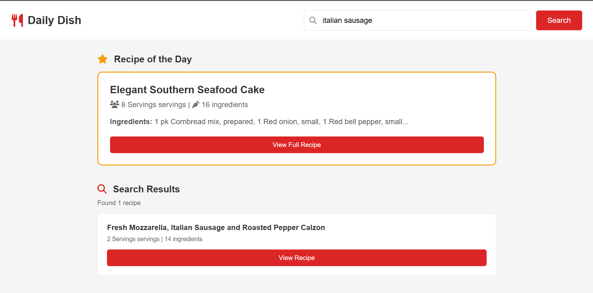
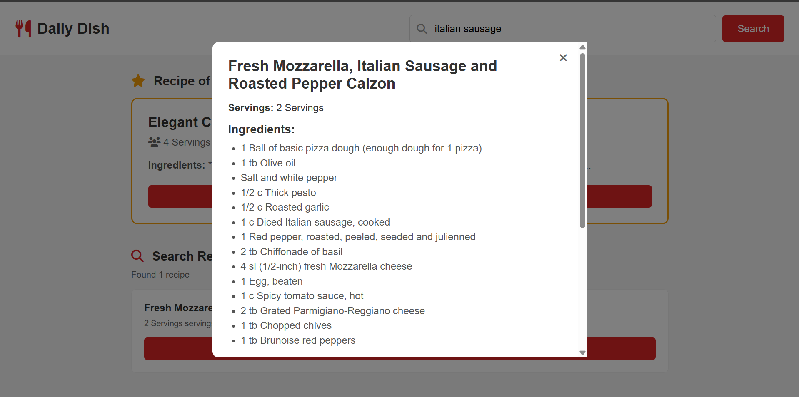

# Daily Dish

A simple recipe finder app with a daily random recipe and search feature.

## Features

- **Recipe of the Day** - Get a random recipe each time you refresh the page
- **Search** - Find recipes by name or ingredient
- **Recipe Details** - View ingredients and cooking instructions in a modal

## Tech Stack

- HTML, CSS, JavaScript
- [API Ninjas Recipe API](https://api-ninjas.com/api/recipe)

## About API Used

### Recipe API

- **Purpose:** Fetch recipe data
- **Documentation:** https://api-ninjas.com/api/recipe
- **Credit:** Powered by API Ninjas
- **Rate Limit:** 3000 requests/month (free tier)

## Setup

1. Clone the repository
2. Get a free API key from [API Ninjas](https://api-ninjas.com/)
3. Create `script/env.js` and add your API key:

   ```javascript
   export const API_KEY = "your_api_key_here";
   ```

4. Open `index.html` in your browser

## Project Structure

```
├── index.html
├── index.css
└── script/
    ├── env.js      # API key (not committed)
    ├── api.js      # API functions
    ├── modal.js    # Modal functions
    └── index.js    # Main app logic
```

## Demo Screenshots




## Quick Links

- The app is live [here](https://daily-dish.gakindi1.tech/)
- Watch the demo video [here](https://youtu.be/iGBpSus56SA?si=5ykw6vno66dSw3WM)
